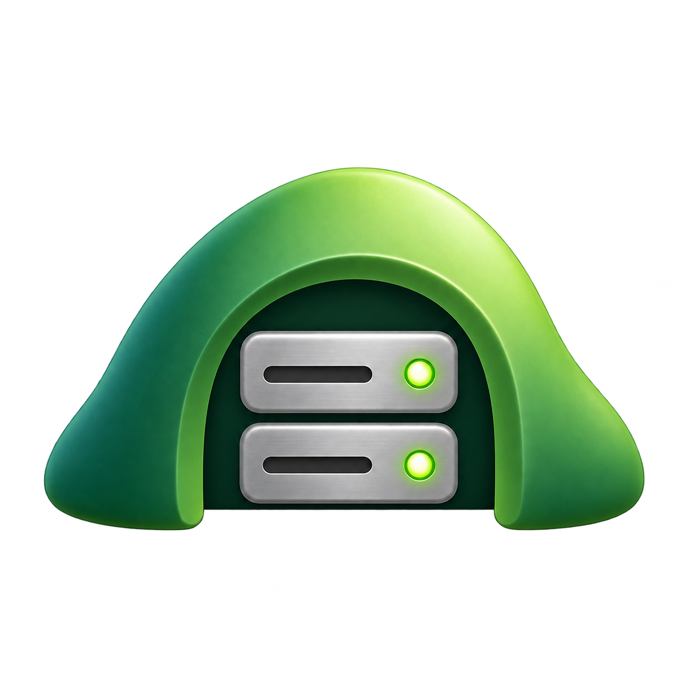

<div align="center">



# Shire

**Turn a Mac into a dependable little personal server.**

</div>

You describe what should be running in one YAML file. Shire keeps the Mac that way: it starts your services at
login, restarts them when they crash, checks they're actually healthy, keeps the Mac awake, tells you when something
breaks (on the Mac and on your phone), and explains the likely cause in plain words.

```text
$ shire status
NAME          PROCESS         HEALTH
postgres      external        healthy · port 5432 open · 1 ms
redbook       running         healthy · port 9222 open · 0 ms
bagend-api    running         healthy · HTTP 200 · 22 ms
bagend-web    crash-looping   unhealthy · connection refused · for 3m
              exit 127, 14 failures in 5m
              ↳ pnpm moved: nvm switched versions since the last apply. Run `shire apply` to re-resolve.

SYSTEM
shire-agent                   running · pid 17925
keep-awake                    active · on power
tailscale                     connected · mac-mini · 100.101.4.12
readiness                     1 warning · run `shire doctor`
```

Shire is Mac-only, local-first and deliberately small. It configures and watches `launchd` rather than replacing
it, and it isn't a general process manager. See [PLAN.md](PLAN.md) for the product thinking behind it.

## What you get

- **`shire`**: the command line (`apply`, `status`, `doctor`, `logs`, `restart`, `alerts`…).
- **shire-agent**: a background LaunchAgent that checks health, keeps the Mac awake, sends alerts and serves the
  phone page.
- **Shire.app**: a menu bar icon (a server rack with a green, amber or red dot) and a window with each service's
  logs, config.yaml with live checks, Readiness and Alerts.
- **A phone page** on your Tailscale network: status, likely causes, recent logs, a Restart button only you can
  press, and push alerts once it's on your Home Screen.

## Install

Requires macOS 14 or later and Swift 6 (Xcode 16+).

```bash
git clone https://github.com/sturdynut/Shire.git shire && cd shire
make test           # run the test suite
make install        # the `shire` command → ~/.local/bin/shire (PREFIX=… to change)
make install-app    # Shire.app → ~/Applications, opens it, adds it to Login Items
```

Install `shire` before running `shire apply`: the LaunchAgents point at the installed binary, and the app runs its
actions (Restart, Apply) through it. After updating Shire, run `make install` and `shire apply`; apply notices the
new binary and restarts shire-agent.

## Quick start

```bash
mkdir -p ~/.config/shire
cp examples/config.yaml ~/.config/shire/config.yaml   # then edit it for your services

shire validate          # schema, commands, folders, dependencies, ports
shire apply --dry-run   # what would change
shire apply             # make it so
shire status
shire doctor            # will this Mac keep serving without you?
```

## Configuration

One file: `~/.config/shire/config.yaml` (or `--config`, or `$SHIRE_CONFIG`). Unknown keys are errors with a
"did you mean…" suggestion, so a typo can't be silently ignored.

```yaml
serverMode: { keepAwake: true }            # hold off idle sleep while on power
presets: { tailscale: { enabled: true } }  # show and check Tailscale
remote: { statusPage: tailnet, actions: restart, port: 7777 }

alerts:
  macos: true            # notifications on the Mac
  phone: true            # web push to the phone page on your Home Screen
  crashLoop: 3 in 5m     # this many failed exits within the window = crash loop
  unhealthyFor: 2m       # a failing health check alerts only after this long

logs: { maxSize: 10MB, keep: 3 }

services:
  postgres:
    external: homebrew.mxcl.postgresql@16   # watched, never managed
    health: { type: tcp, port: 5432 }

  api:
    command: node                 # resolved through your login shell on every apply
    args: [dist/index.js]
    cwd: ~/Code/app/server
    build: pnpm build             # runs on apply (when changed) and on `shire restart`
    envFile: .env                 # read at start; values never go into the plist
    env: { NODE_ENV: production }
    dependsOn: [postgres]         # starts after postgres answers its health check
    restart: always               # always | on-failure | never
    health: { type: http, url: http://localhost:3001/health, interval: 30s, timeout: 3s }

  redbook:
    command: /Applications/RedBook.app/Contents/MacOS/RedBook
    args: [--remote-debugging-port=9222]
    adoptRunning: true            # if you already opened it, watch that copy instead of launching another
    health: { type: tcp, port: 9222 }
```

| Service key | Meaning |
|---|---|
| `command`, `args` | What to run. Bare names (`pnpm`) are resolved through your login shell, so nvm and Homebrew work. |
| `cwd` | Working folder; `~` is expanded. |
| `env`, `envFile` | Environment. `envFile` is relative to `cwd` and loaded at start, so secrets stay out of launchd files. |
| `build` | Shell command run before (re)starting on `apply` and `shire restart`, never on automatic respawns. A failed build leaves the running version alone. |
| `restart` | `always` (default), `on-failure` or `never`. |
| `dependsOn` | Other services that must answer their health check first. |
| `health` | `http` (any status below 500 counts as up) or `tcp`. Failing services are rechecked every 5 seconds. |
| `external` | Label of a launchd job Shire only watches, such as Homebrew's Postgres. |
| `adoptRunning` | For single-instance apps: watch an already-open copy, and launch one only when it goes away. |
| `serve` | Reserved for sharing a service itself on the tailnet (not implemented yet). |

`remote` keys: `statusPage` (`tailnet` or `off`), `actions` (`restart` or `read-only`), `port` (the tailnet HTTPS
port, default 7777) and `localPort` (where shire-agent listens on 127.0.0.1, default 7780).

## Commands

| Command | What it does |
|---|---|
| `shire validate` | Checks the config and shows where each command resolves. |
| `shire apply [--dry-run] [--no-build]` | Makes the Mac match the config. Only changed services restart; removed ones are stopped. Also installs shire-agent and shares the phone page. |
| `shire status` | Services, health (with how long something has failed), likely causes and the SYSTEM rows. |
| `shire doctor` | Readiness: automatic updates, FileVault and login, restart after power loss, lid and display, battery, disk, Tailscale, shire-agent. Each problem comes with its fix. |
| `shire logs <service> [-n 100] [-f] [--stdout\|--stderr]` | Service logs. |
| `shire start\|stop\|restart <service>` | `restart` runs the build step first (`--no-build` to skip). |
| `shire alerts [-n 20] [--test]` | Recent alerts and open incidents; `--test` sends a test notification. |
| `shire uninstall` | Stops and removes everything Shire installed, including the phone page share. Config and logs stay. |

## How it works

```text
config.yaml ─► shire apply ─► ~/Library/LaunchAgents/com.shire.<service>.plist ─► shire run <service> ─► your command
                    │
                    └─► com.shire.agent (shire-agent)
                          ├─ health checks, incidents, alerts ─► Shire.app notifications, web push
                          ├─ keep-awake power assertion
                          └─ phone page on 127.0.0.1 ◄─ tailscale serve (HTTPS, tailnet only)
```

- **launchd does the supervising.** Each service is a LaunchAgent labeled `com.shire.<name>`; Shire never touches
  other agents. `apply` compares the generated plist with the installed one and reloads only what changed.
- **Services run inside `shire run`.** It waits for dependencies, loads the env file, runs the real command with
  its output captured into rotating logs (`~/Library/Logs/shire/<service>.{stdout,stderr}.log`), records starts and
  exits for crash-loop detection, and exits with the command's status so launchd's restart policy applies.
- **PATH is narrow on purpose.** A service gets its command's folder, any `env.PATH`, Homebrew and the system, not
  your whole login PATH. Switching Node versions with nvm restarts only the services that use Node.
- **Health lives in shire-agent**, which checks each service on its own interval and knows how long it has been
  failing. `shire status`, the app and the phone page all read that.
- **Alerts are incidents.** A crash loop, a health check failing for longer than `unhealthyFor`, a new readiness
  warning, or downtime after a restart each alert once, and once more when fixed. Open incidents are saved, so
  restarting the agent never repeats an alert.
- **Likely causes** come from a fixed list: a command moved by nvm, command not found, port in use, permission
  denied, missing folder, a dependency down, an app already open without Shire's flags.
- **Keep-awake** is a `PreventUserIdleSystemSleep` assertion held while server mode is on and the Mac is on power.
  On battery it's released, so a laptop sleeps before its battery dies.

## The menu bar app

`make install-app` builds `Shire.app` (signed ad hoc, which is fine for your own Mac), installs it to
`~/Applications`, opens it and adds it to Login Items ("Open at login" in the menu turns that off). The popover
shows each service, Tailscale and keep-awake; hovering a service offers Restart. The window has:

- **Services:** process and health, likely cause, and live logs (both streams or one, follow, reveal in Finder).
- **config.yaml:** edit in place with live schema checks, resolved commands and an "Apply will…" preview; Save & Apply.
- **Readiness** and **Alerts**, including "Send test alert".

While the app runs, it posts alerts as notifications from Shire. When it isn't running, shire-agent falls back to
`osascript` (those show as coming from Script Editor). Quitting the menu leaves services and shire-agent running.

## The phone page

With `remote: { statusPage: tailnet }`, `shire apply` runs `tailscale serve --https=<port>` pointing at shire-agent
on 127.0.0.1. It refuses to take a tailnet port that already serves something else.

Open `https://<this-mac>.<tailnet>.ts.net:7777` on your phone:

- Status, services, likely causes, the last lines of each service's log, readiness warnings and recent alerts.
  It follows the phone's light or dark setting.
- **Restart** works only for this Mac's owner (from Tailscale's `Tailscale-User-Login` header), only with
  `remote.actions: restart`, and asks first. Requests also need an `X-Shire` header, which browsers won't send
  cross-site without a preflight this server never approves.
- **Alerts on your phone:** Share → Add to Home Screen, open it from there, and tap "Turn on alerts". Alerts are
  encrypted on the Mac (RFC 8291) and signed with the Mac's own VAPID key (RFC 8292). Apple's push service is the
  only thing outside your tailnet that handles them, and it can't read them.

## Files

| Path | What |
|---|---|
| `~/.config/shire/config.yaml` | Your config. |
| `~/Library/LaunchAgents/com.shire.*.plist` | Generated LaunchAgents (`com.shire.agent` is shire-agent). |
| `~/Library/Logs/shire/` | Service logs (rotated), `shire-agent.log`, and `<service>.shire.log` for wrapper failures. |
| `~/Library/Application Support/Shire/` | `agent.json`, `incidents.json`, `alerts.jsonl`, `events/`, `push-subscriptions.json`, `vapid-key`. |

## Known limits

- **FileVault and restarts:** with FileVault on, macOS can't log in by itself, so after a restart your services and
  Tailscale start only once you log in. While the Mac waits at the login screen nothing can alert you; after you
  log in, Shire reports how long services were down. `shire doctor` flags automatic macOS updates, the most common
  cause of surprise restarts.
- **Closing a MacBook's lid** sleeps it unless it's on power with an external display. Preventing that needs root,
  so it's out of scope.
- **Alert rules** can't be switched off one by one yet. `alerts.macos: false` turns off Mac notifications (alerts
  are still logged).
- **`serve:` per service** (sharing an app itself on the tailnet) is reserved but not implemented.
- If a Mac can't resolve its own MagicDNS name, the phone page still works from other devices on the tailnet.

## Development

```text
Sources/
├── ShireCore/    # config, launchd, reconciler, runner, health, alerts, readiness, phone page, web push
├── shire/        # the command line (swift-argument-parser)
└── ShireApp/     # the SwiftUI menu bar app
Tests/ShireCoreTests/
App/               # Shire.app Info.plist and build-icon.sh (makes AppIcon.icns from the logo)
assets/branding/   # the logo (shire-logo-transparent.png) and earlier concepts
scripts/           # make-phone-icons.swift (`make icons` regenerates the phone icons from the logo)
examples/config.yaml
```

`make test` runs the suite. Tests never touch the real launchd, your home folder or notifications. Design mockups
(light and dark, Mac and phone) are linked from [PLAN.md](PLAN.md).
